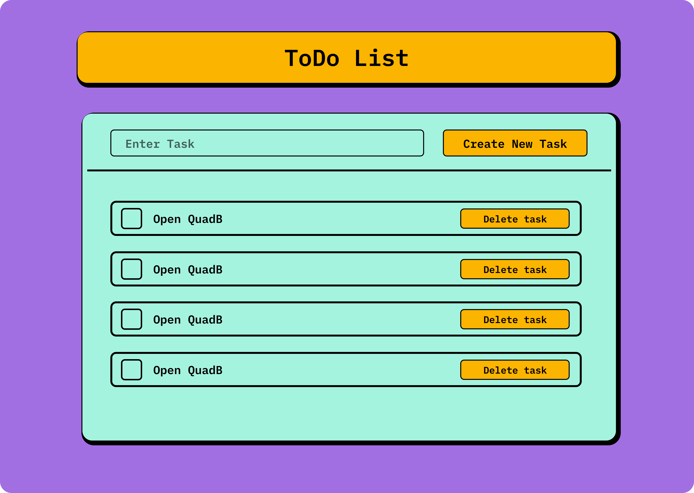

# ToDo List App



A simple ToDo list application built with React, Redux, and Tailwind CSS.

## Table of Contents

- [Features](#features)
- [Demo](#demo)
- [Installation](#installation)
- [Usage](#usage)
- [Technologies Used](#technologies-used)
- [Contributing](#contributing)
- [License](#license)

## Features

- Add new tasks
- View list of tasks
- Mark tasks as completed
- Delete tasks
- Mobile-responsive design

## Demo

You can see a live demo of the application [here](https://to-do-list-beige-gamma.vercel.app/).

## Installation

To run this project locally, follow these steps:

1. Clone the repository:

   ```bash
   git clone https://github.com/your-username/todo-list-app.git

2. Navigate into the project directory:

   ```bash
   cd todo-list-app

3. Install the dependencies:

   ```bash
   npm install

4. Start the development server:

   ```bash
   npm start

5. Open your browser and visit http://localhost:3000 to view the app.

## Usage

- Enter a task in the input field and press Enter or click "Create New Task" to add it to the list.
- Click the checkbox next to a task to mark it as completed. Completed tasks will have a line-through styling.
- Click the "Delete Task" button or the trash icon to delete a task from the list.

## Technologies Used

- React
- Redux
- Tailwind CSS
- React Icons

## Contributing

Contributions are welcome! If you'd like to contribute to this project, please follow these steps:

1. Fork the repository.
2. Create a new branch (git checkout -b feature/my-feature).
3. Make your changes.
4. Commit your changes (git commit -am 'Add new feature').
5. Push to the branch (git push origin feature/my-feature).
6. Create a new Pull Request.


